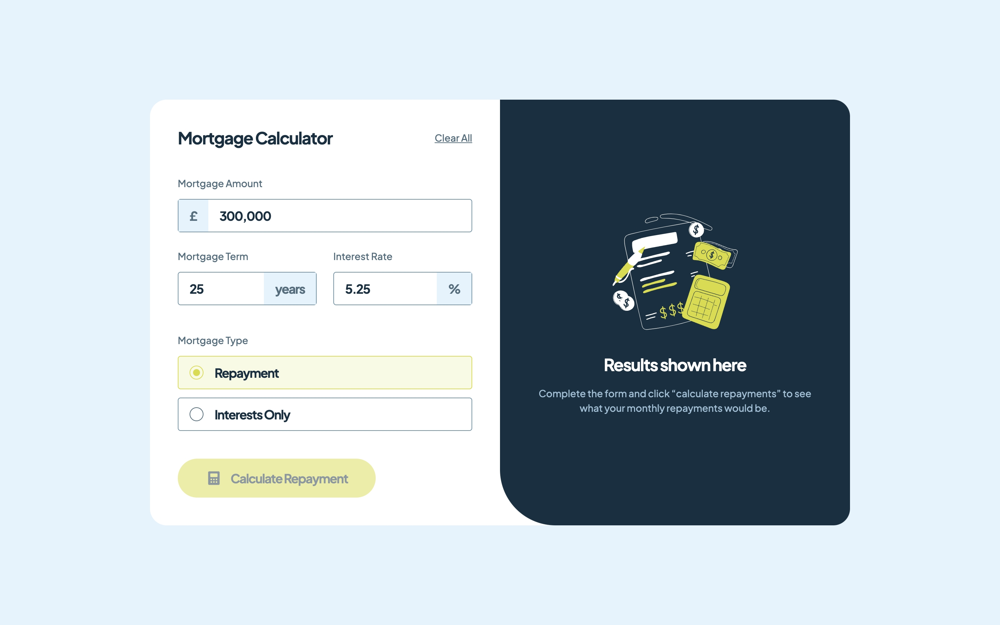
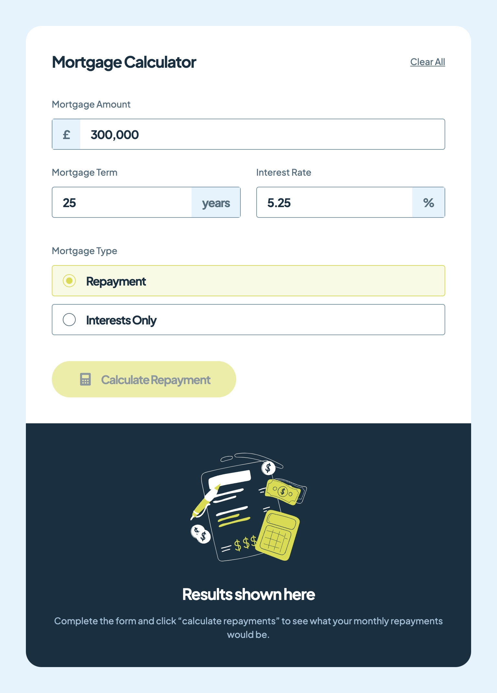
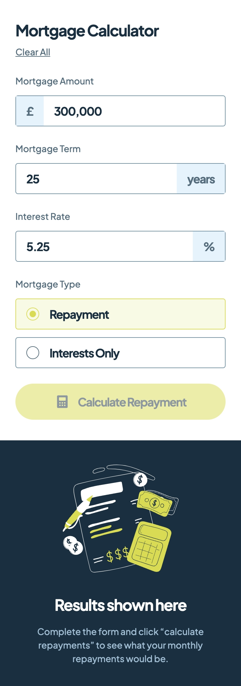

# Frontend Mentor - Mortgage repayment calculator solution

This is a solution to the [Mortgage repayment calculator challenge on Frontend Mentor](https://www.frontendmentor.io/challenges/mortgage-repayment-calculator-Galx1LXK73). Frontend Mentor challenges help you improve your coding skills by building realistic projects.

## Table of contents

- [Frontend Mentor - Mortgage repayment calculator solution](#frontend-mentor---mortgage-repayment-calculator-solution)
  - [Table of contents](#table-of-contents)
  - [Overview](#overview)
    - [The challenge](#the-challenge)
    - [Screenshot](#screenshot)
    - [Links](#links)
  - [My process](#my-process)
    - [Built with](#built-with)
    - [What I learned](#what-i-learned)
    - [Continued development](#continued-development)
    - [Useful resources](#useful-resources)

## Overview

### The challenge

Users should be able to:

- Input mortgage information and see monthly repayment and total repayment amounts after submitting the form
- See form validation messages if any field is incomplete
- Complete the form only using their keyboard
- View the optimal layout for the interface depending on their device's screen size
- See hover and focus states for all interactive elements on the page

### Screenshot

Desktop

Tablet

Mobile

### Links

- [Live Site URL](https://mortgage-repayment-calculator.frilly.dev/)

## My process

### Built with

- [Angular](https://angular.dev/)
- [Tailwind CSS](https://tailwindcss.com/)

### What I learned

This is my first project with the Angular framework. I knew this framework was very opinionated, complicated and has a very steep learning curve. Overall, I still like the simplicity of Vue more. SolidJS, which is a signal-based version and cleaner version of React holds second place for me. And surprisingly, Angular is already shot up to third place for me, over Svelte and React.

Angular strikes me as a true all-in-one solution, there's literally everything already included in Angular. There are so much stuff to learn about. This project's coding practices are probably bad as I still hold a Vue mindset when working with this.

### Continued development

I would love to try more of Angular's features. I chose this project to start with Angular as it is not too difficult, but Angular alone took me 2 days to get a very basic app working.

### Useful resources

- [Angular Docs](https://angular.dev/)
- [Angular Docs, but JP version](https://angular.jp/)
